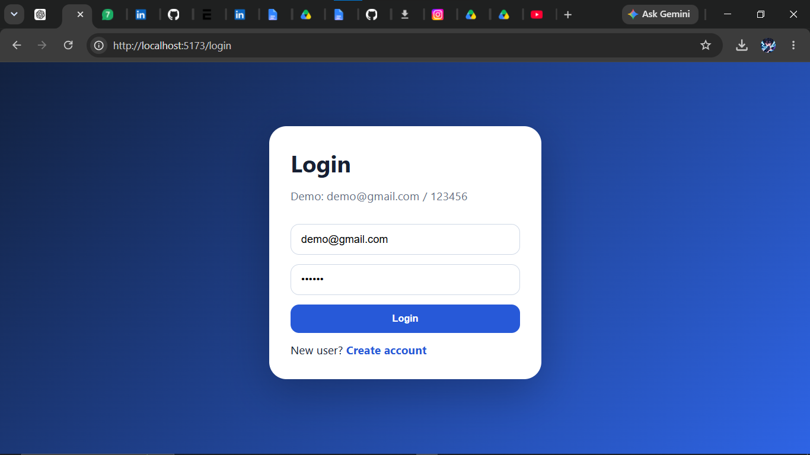
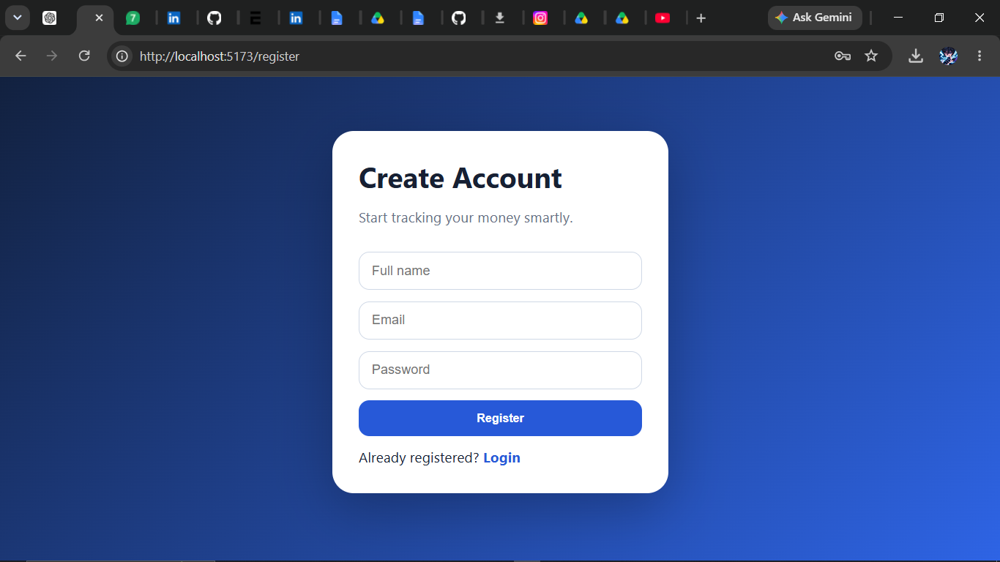
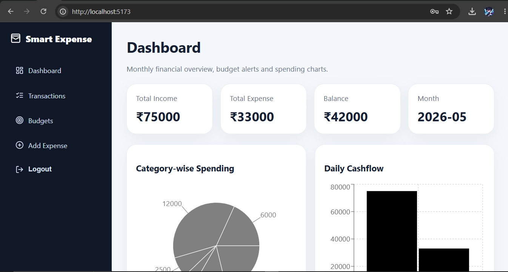
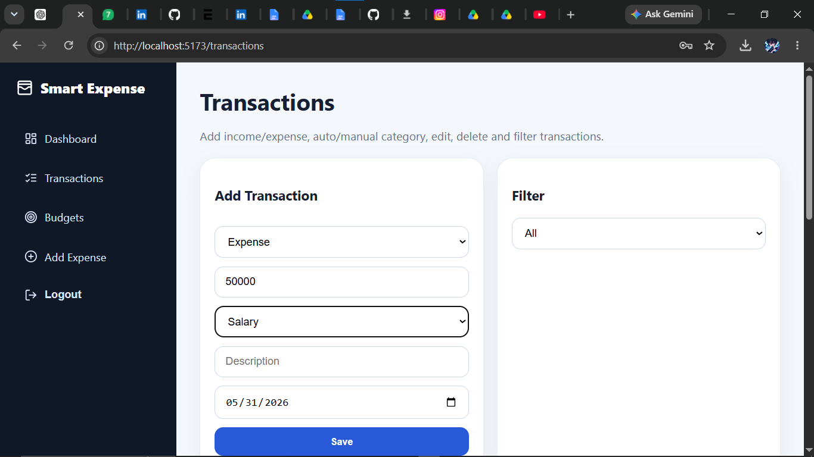
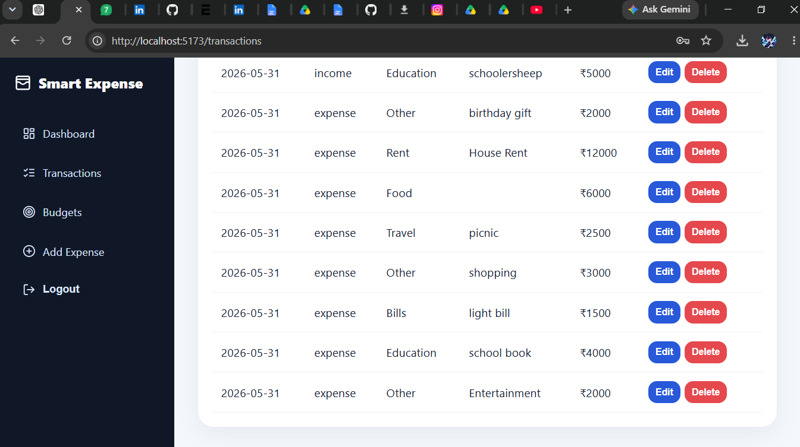
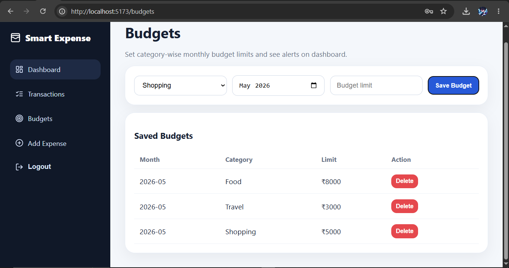
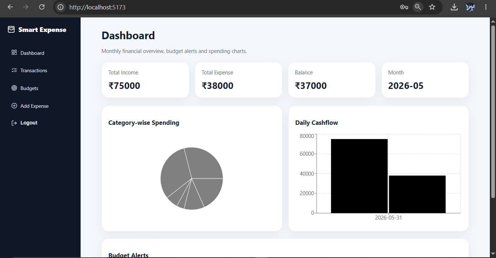
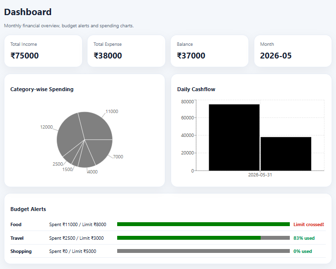

# Smart Expense Tracker Web App — No MongoDB Version

A beginner-friendly full-stack expense tracker built with **React + Node.js + Express**. This version uses a simple **JSON file database**, so you do **not** need MongoDB, Atlas, Compass, or Mongoose.

## Demo Login

After running seed command:

```txt
Email: demo@gmail.com
Password: 123456
```

## Features

- User register and login
- JWT authentication
- Add income and expenses
- Edit and delete transactions
- Category filter
- Auto-category helper from description keywords
- Monthly dashboard summary
- Category-wise spending chart
- Daily income vs expense chart
- Category-wise monthly budget
- Budget alert when spending crosses limit
- Simple JSON database for easy student demo
- GitHub-ready folder structure

## Tech Stack

### Frontend
- React.js
- Vite
- React Router
- Recharts
- CSS

### Backend
- Node.js
- Express.js
- JWT
- bcryptjs
- JSON file database

## Folder Structure

```txt
Smart-Expense-Tracker-No-MongoDB/
├── client/
│   ├── src/
│   │   ├── pages/
│   │   ├── services/
│   │   ├── App.jsx
│   │   ├── main.jsx
│   │   └── style.css
│   ├── package.json
│   └── .env.example
├── server/
│   ├── src/
│   │   ├── auth.js
│   │   ├── db.js
│   │   ├── seed.js
│   │   └── server.js
│   ├── data/
│   │   └── db.json
│   ├── package.json
│   └── .env.example
├── docs/
├── README.md
└── .gitignore
```

## How to Run

### 1. Backend

```bash
cd server
npm install
copy .env.example .env
npm run seed
npm start
```

Backend runs on:

```txt
http://localhost:5000
```

### 2. Frontend

Open a second terminal:

```bash
cd client
npm install
copy .env.example .env
npm start
```

Frontend runs on:

```txt
http://localhost:5173
```

## Windows Full Commands

From the main project folder:

```bash
cd server
npm install
copy .env.example .env
npm run seed
npm start
```

Second terminal:

```bash
cd client
npm install
copy .env.example .env
npm start
```

## API Endpoints

| Method | Endpoint | Description |
|---|---|---|
| POST | `/api/auth/register` | Register user |
| POST | `/api/auth/login` | Login user |
| GET | `/api/transactions` | Get transactions |
| POST | `/api/transactions` | Add transaction |
| PUT | `/api/transactions/:id` | Update transaction |
| DELETE | `/api/transactions/:id` | Delete transaction |
| GET | `/api/budgets` | Get budgets |
| POST | `/api/budgets` | Add budget |
| DELETE | `/api/budgets/:id` | Delete budget |
| GET | `/api/dashboard` | Dashboard analytics |

## Screenshots to Add

Create screenshots and save them in `docs/screenshots/`:
## Output Screenshots

### Login Page


### Register Page


### Dashboard


### Add Income


### Add Expense


### Budget Page


### Charts


### Final Output



## Interview Explanation

This is a full-stack Smart Expense Tracker Web App. Users can register, log in, add income and expenses, categorize transactions, set monthly budgets, and view dashboard reports. I built the frontend using React and the backend using Node.js and Express. Instead of MongoDB, I used a JSON file database to make the project easy to run for students. The project demonstrates authentication, REST APIs, CRUD operations, data visualization, budget logic, and full-stack integration.

## Future Improvements

- CSV import
- PDF report export
- Receipt OCR
- Recurring expenses
- Multi-currency support
- Online deployment


### Developed By
**Atharv Vishnudas Bunde**
Mechatronics Engineering Student

